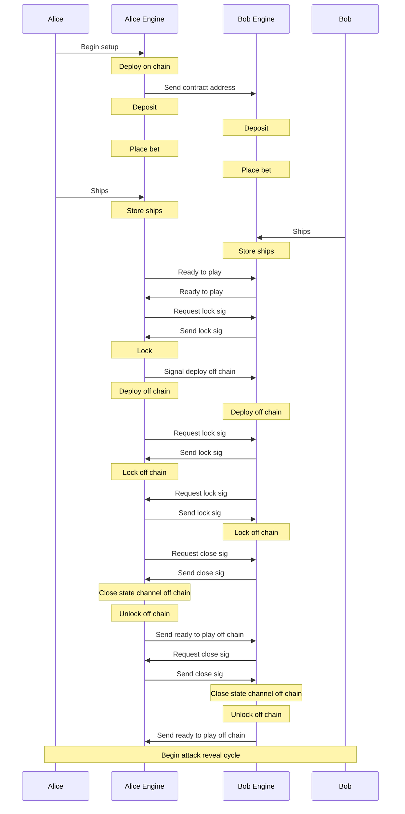

Setup flow
=================

Setup involves deploying a battleship on chain, locking it, then deploying a battleship off chain and unlocking it with state from the on chain contract.

```mermaid
sequenceDiagram;
    participant A as Alice
    participant AE as Alice Engine
    participant BE as Bob Engine
    participant B as Bob
    A->>AE: Begin setup
    Note over AE: Deploy on chain
    AE->>BE: Send contract address
    Note over AE: Deposit
    Note over BE: Deposit
    Note over AE: Place bet
    Note over BE: Place bet
    A->>AE: Ships
    Note over AE: Store ships
    B->>BE: Ships    
    Note over BE: Store ships
    AE->>BE: Ready to play
    BE->>AE: Ready to play
    AE->>BE: Request lock sig
    BE->>AE: Send lock sig
    Note over AE: Lock
    AE->>BE: Signal deploy off chain
    Note over AE: Deploy off chain
    Note over BE: Deploy off chain
    
    #locking off chain
    AE->>BE: Request lock sig
    BE->>AE: Send lock sig
    Note over AE: Lock off chain

    BE->>AE: Request lock sig
    AE->>BE: Send lock sig
    Note over BE: Lock off chain

    AE->>BE: Request close sig
    BE->>AE: Send close sig
    Note over AE: Close state channel off chain
    Note over AE: Unlock off chain
    AE->>BE: Send ready to play off chain

    BE->>AE: Request close sig
    AE->>BE: Send close sig
    Note over BE: Close state channel off chain
    Note over BE: Unlock off chain
    BE->>AE: Send ready to play off chain

    Note over A,B: Begin attack reveal cycle
```